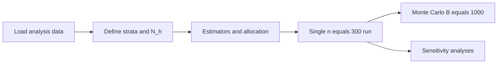

# Sampling and simulation — consolidated plan

## Goal

Estimate the **mean nightly Airbnb listing price** in Vancouver using **simple random sampling (SRS)** and **stratified random sampling by neighbourhood** (proportional and Neyman allocation), validate behavior with **Monte Carlo simulation**, and run **sensitivity analyses** on outliers/caps. **All sampling and simulation code lives in one file** (recommended: `sampling_simulation.ipynb` in the project root).

**Out of scope for code:** **Ratio estimation** is **not** implemented — EDA showed price and `number_of_reviews` are only weakly related; note this omission in the report.

## Source documents

- **Proposal:** [DATA 407 Project Proposal.pdf](file:///Users/takshgirdhar/Library/Mobile%20Documents/com~apple~CloudDocs/Courses/DATA%20407/Project/DATA%20407%20Project%20Proposal.pdf) — SRS n=300, stratified designs, simulation, DEFF, real-data analysis.
- **EDA:** [EDA.ipynb](EDA.ipynb) — defines the analysis population and stratum structure.
- **Formulas (SRS + stratified; not DEFF/MC theory in notes):** [DATA 407 Summary Notes 2.pdf](file:///Users/takshgirdhar/Downloads/DATA%20407%20Summary%20Notes%202.pdf) — implementation should match these estimators and variance/CI structure.

## What EDA changed vs the proposal (carry into analysis and report)

| Topic            | Proposal                             | EDA / locked-in choice                                                                                                             |
| ---------------- | ------------------------------------ | ---------------------------------------------------------------------------------------------------------------------------------- |
| Population size  | ~5,685 listings; heavy missing price | **N = 4,702** with observed price; **3** listings dropped for missing price                                                        |
| Outliers         | Cap at $5,000                        | Keep full prices for **main** run; **sensitivity** with cap and/or IQR flag (`price_outlier_iqr` in analysis dataset)              |
| Stratification   | By neighbourhood                     | **23** strata; use `**neighbourhood_cleansed`** (complete); **Strathcona** has **N_h = 19** — allocation/rounding must be explicit |
| Ratio estimation | Reviews as auxiliary                 | **Skipped** — weak relationship; state in report only                                                                              |

## Single notebook structure

1. **Setup** — Imports, fixed RNG seed, load [analysis_dataset.csv](analysis_dataset.csv) (or reproduce EDA filter so N = 4,702).
2. **Population** — N; strata from `neighbourhood_cleansed`; verify \sum_h N_h = N; per-stratum N_h, and for Neyman, population S_h or planned use of sample s_h only where the course allows.
3. **Estimators (helpers)** — Pure functions with markdown immediately above each:
  - SRS: \bar{y}; \widehat{\mathrm{Var}}(\bar{y}) = (1-f)s^2/n, f=n/N.
  - Stratified: \hat{\bar{Y}}_{st} = \sum_h W_h \bar{y}*h, W_h=N_h/N; \widehat{\mathrm{Var}}(\hat{\bar{Y}}*{st}) = \sum_h W_h^2(1-f_h)s_h^2/n_h, f_h=n_h/N_h.
4. **Allocation** — Proportional: n_h \propto N_h. Neyman: n_h \propto N_h S_h. Implement **rounding** so \sum_h n_h = n; document rule (e.g. largest remainders); ensure no stratum gets n_h=0 if the design requires at least one unit per stratum.
5. **One real sample** — **n = 300**; point estimates and **95% CIs** for SRS and both stratified designs; **DEFF** comparing stratified to SRS (per proposal).
6. **Monte Carlo** — **B = 1,000** replications per design (SRS, stratified proportional, stratified Neyman): distribution of \bar{y}, empirical vs theoretical variance, **CI coverage**, DEFF — as in proposal.
7. **Sensitivity** — Repeat key outputs with (a) price capped at **$5,000**; (b) optional exclusion or down-weighting using `**price_outlier_iqr`** from EDA.

## Confidence intervals

- Use **t critical values when sample sizes are small** (per your preference): e.g. SRS uses t_{n-1}; stratified combined mean CI can use normal approximation if your instructor accepts it for large overall n, otherwise document **effective df** or use conservative t as specified in course notes.
- Always show **FPC** in variance formulas where applicable (notes emphasize FPC for SRS).

## Math-to-code audit (required)

- Small **audit table** in the notebook: `method` | `formula` | `function name` | `assumption`.
- **Sanity checks:** 0 \le f \le 1; \sum_h n_h = n; \sum_h N_h = N; no division by zero in strata.

## Deliverables outside the notebook

- **Report/slides:** Updated N, missingness, omission of ratio estimation, sensitivity narrative, DEFF interpretation, neighbourhood highlights.
- **Code appendix:** Point to the single `sampling_simulation.ipynb` (or `.py`).

## Risks

- **Small strata:** With **n = 300** and **23** strata, proportional allocation may assign **< 1** before rounding — rounding rule and achieved n_h must be reported.
- **Neyman:** Needs reliable S_h; if only sample-based estimates are available before allocation, document the two-phase or pilot convention if required by the course.

